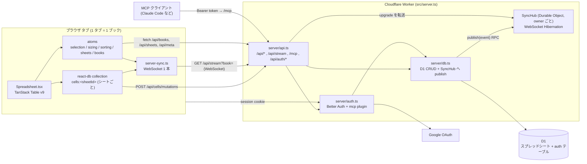
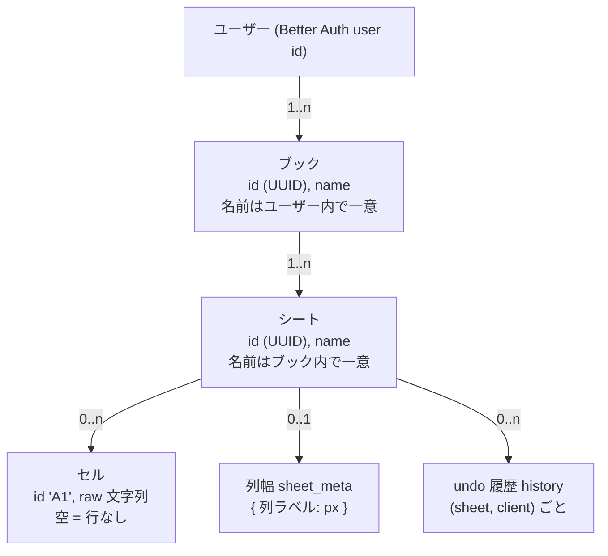

# Architecture

tanstack-spreadsheet は、ブラウザで動くスプレッドシートである。データの正本は Cloudflare D1（SQLite）にあり、開いている全タブと MCP クライアントが同じデータを見る。この文書は全体像と基本概念を扱い、詳細は `docs/architecture/` の分冊に置く。

| 分冊                                                 | 内容                                                                      |
| ---------------------------------------------------- | ------------------------------------------------------------------------- |
| [data-model.md](docs/architecture/data-model.md)     | SQLite スキーマ、所有権と権限判定、作成 / 削除の連鎖、スキーマ移行        |
| [sync.md](docs/architecture/sync.md)                 | ブラウザ内ミラーとサーバ DB の同期、変更通知、楽観的書き込み、undo / redo |
| [spreadsheet.md](docs/architecture/spreadsheet.md)   | セル ID、グリッド、数式評価、構造操作、選択と編集、ソート / フィルタ      |
| [auth-and-mcp.md](docs/architecture/auth-and-mcp.md) | Google ログイン、MCP 向け OAuth 2.1、MCP エンドポイントとツール           |

## 技術スタック

| 層               | 採用                                                                                                                                           |
| ---------------- | ---------------------------------------------------------------------------------------------------------------------------------------------- |
| フレームワーク   | TanStack Start (React 19, Vite 8)、TanStack Router の file-based routing                                                                       |
| グリッド         | TanStack Table v9 (`tableFeatures` API、選択 / 列幅 / ソート / フィルタの state は atom 所有)                                                  |
| クライアント状態 | TanStack Store (`createAtom` / `Store`)、TanStack DB (`createCollection`、セルのみ)                                                            |
| サーバ           | Cloudflare Workers。`src/server.ts` → `server/api.ts` が `/api/*`、`/api/stream`、`/mcp`、`/api/auth/*` を処理し、残りを TanStack Start に渡す |
| DB               | Cloudflare D1 (SQLite)。スキーマは `migrations/*.sql`、変更通知は Durable Object `SyncHub`                                                     |
| 認証             | Better Auth 1.7 + Google。`@better-auth/mcp` で OAuth 2.1 認可サーバ                                                                           |
| MCP              | `@modelcontextprotocol/sdk` の streamable HTTP (stateless)                                                                                     |
| スタイル         | Tailwind CSS 4、テーマは CSS 変数 (light / dark / auto)                                                                                        |
| ツール           | pnpm、mise (node / pnpm / fnox 固定)、fnox (age + keychain で秘密情報)、oxlint / oxfmt                                                         |

## 全体構成



書き込みはすべて `server/db.ts` を通り、確定するたびに所有者の `SyncHub` へ publish され、そこから WebSocket 購読者へ届く。ブラウザも MCP も同じ経路で書くため、MCP の書き込みが開いているタブへ即時に届く。

## 基本概念

データは **ブック > シート > セル** の 3 層である。



### ブック

- ログインユーザーが所有する。他人のブックは一覧に出ず、URL 直打ちでも 404 を返す（403 ではないので存在の有無も分からない）
- URL が `/b/<bookId>` で表す。`/` は自分の先頭ブックへリダイレクトし、1 冊も無ければ 1 冊作る
- 作成時に「シート1」が 1 枚付く。名前省略時は「ブック{N}」を自動採番する
- 最後の 1 冊は削除できない。削除するとシート、セル、列幅、履歴が連鎖して消える

### シート

- ブックに属し、id は UUID でグローバルに一意である。ブックの所属を持つのは `sheets` テーブルだけで、セル、列幅、履歴はシート id だけで引く
- 名前省略時は「シート{N}」を自動採番する。同名は同じブック内でだけ拒否する
- 最後の 1 枚は削除できない
- どのシートを開いているかはタブローカルで、ブックごとに localStorage に憶える。他タブのシート切替には追従しない

### セル

- id は Excel 形式（`A1`、`AA12`）。列は 0 始まりの index を bijective base-26 で文字にし、行は 1 始まりである
- 値は `raw` 文字列 1 つだけ持つ。`=` で始まれば数式。表示値は読むたびに評価する（保存しない）
- 空文字（空白のみ含む）の書き込みは削除を意味する。DB に空セルの行は存在しない
- グリッドの行数と列数（既定 26 列 × 50 行）は表示上の大きさで、保存しない。保存済みセルが収まるよう読み込み時に広げる

## ディレクトリ構成

```
server/
  api.ts           HTTP ルーティング全部、WebSocket upgrade の転送、MCP サーバ、OAuth ゲート
  db.ts            D1 の CRUD、履歴、SyncHub への publish
  sync-hub.ts      Durable Object。owner ごとに WebSocket を束ね、snapshot と変更を配る
  auth.ts          Better Auth インスタンス (Google + jwt + mcp plugin、D1 直結)
  auth-options.ts  auth.ts と auth.cli.ts が共有するオプション
  auth.cli.ts      `pnpm auth:generate` 用（node:sqlite in-memory）
migrations/        0001_auth.sql (生成物)、0002_spreadsheet.sql
src/
  server.ts        Worker entry。handleApi → TanStack Start。SyncHub を export
  routes/          "/" (ログイン / リダイレクト)、"/b/$bookId"、"/consent"。全て ssr: false
  components/      Spreadsheet.tsx (グリッド本体)、SheetTabs、BookMenu、LoginScreen など
  db-collections/  server-sync.ts (WebSocket)、cells.ts (collection)、sheets.ts / books.ts / sheet-meta.ts (API)
  lib/             sheet-store.ts (atoms)、formula.ts、structure.ts、history.ts、columns.ts、tsv.ts
vite.config.ts     cloudflare() を先頭に登録し、Start の server entry (src/server.ts) を workerd で動かす
wrangler.jsonc     Worker 名、D1 / Durable Object binding、migrations
```

## 状態の置き場所

どこに保存され、誰と同期するかは状態ごとに違う。

| 状態                   | 置き場所                   | 同期範囲                                    |
| ---------------------- | -------------------------- | ------------------------------------------- |
| セル                   | D1 `cells`                 | 全タブ、MCP に WebSocket で即時             |
| 列幅                   | D1 `sheet_meta`            | 全タブに WebSocket で即時                   |
| シート一覧、ブック一覧 | D1                         | 全タブに WebSocket で即時（一覧全体を再送） |
| undo / redo 履歴       | D1 `history`               | 同じ client id を持つタブ間で共有           |
| client id              | localStorage               | 同じブラウザの全タブで 1 つ                 |
| 開いているシート       | localStorage（ブックごと） | タブローカル                                |
| ソート、フィルタ       | localStorage（シートごと） | タブローカル、表示のみでデータに触れない    |
| グリッドの行数 / 列数  | メモリ（シートごとに退避） | タブ内のみ、リロードで初期値 + 復元         |
| 選択、編集中セル       | メモリ atom                | シート切替でリセット                        |
| テーマ                 | localStorage               | タブローカル                                |

## 設計上の主な判断

- **API は手書きルータ 1 本 (`server/api.ts`) にまとめ、Start の catch-all より先に処理する。** 変更通知は Worker のプロセスに依存せず Durable Object が持つので、Worker の複数インスタンスにまたがっても購読者が切れない
- **セルだけ react-db collection、一覧は atom。** シート一覧とブック一覧は小さく変更も稀で、サーバが毎回全量を送るので、atom で足りる
- **collection はシートごとに 1 つ、WebSocket 接続はタブごとに 1 本。** 全 collection が `server-sync.ts` の 1 本を共有し、切断時はバックオフ付きで再接続して snapshot で同期し直す
- **undo 履歴はサーバに置き、client ごとに持つ。** 別タブや MCP の書き込みと混在しても、自分の操作だけを戻せる。衝突したセルは戻さない
- **全ルートを `ssr: false` にする。** セルはログイン後にサーバから取るため、サーバ側で描画すると空の殻とハイドレーション不一致を起こす
- **404 で 403 を隠す。** 他人のブックやシートは「存在しない」と同じ応答にし、id の存在を漏らさない
