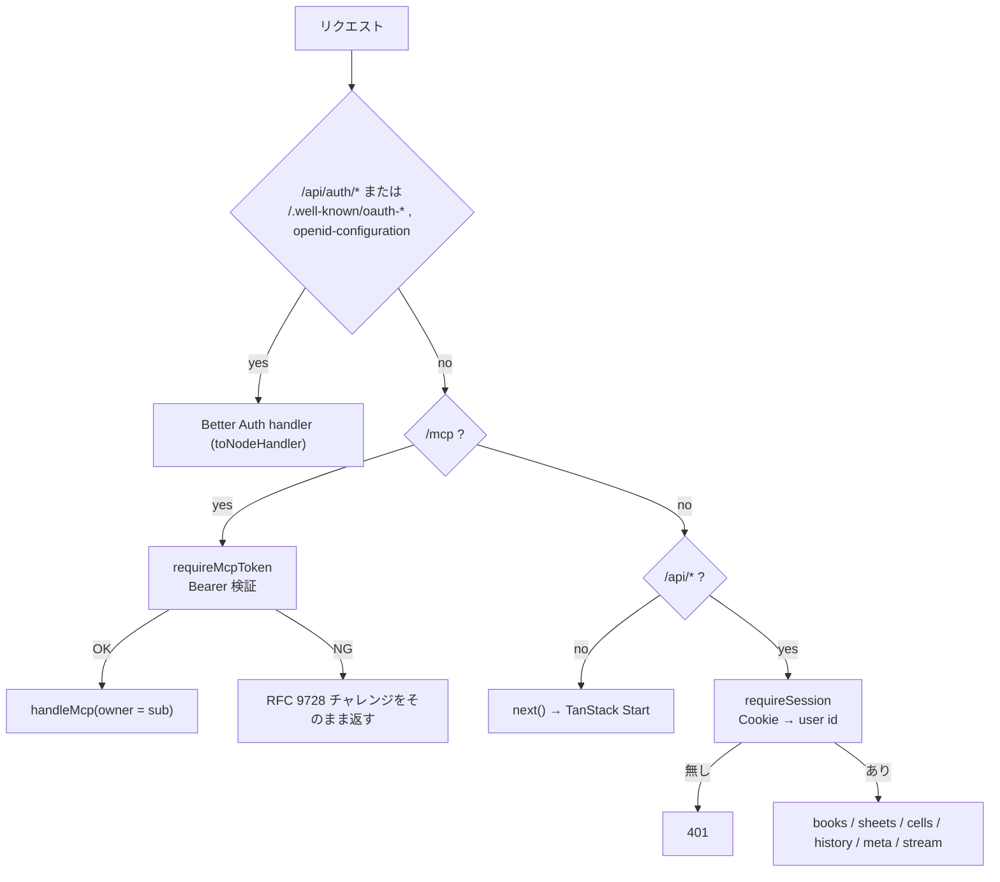
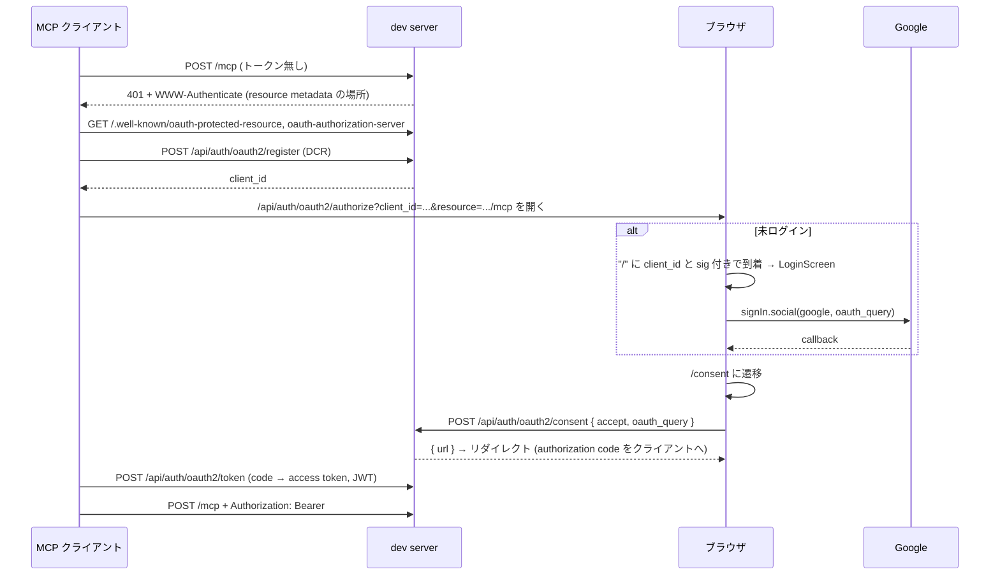
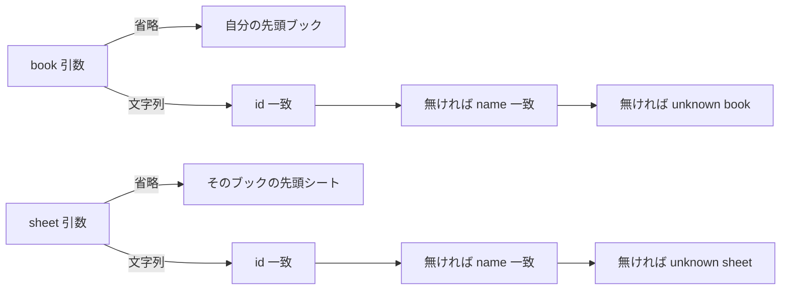

# 認証と MCP

ブラウザは Google ログインのセッション Cookie で、MCP クライアントは OAuth 2.1 のアクセストークンで認証する。どちらも Better Auth の user id に解決し、その id が所有するブックだけを扱う。この文書は、Better Auth の構成、ブラウザのログイン、MCP クライアントの認可、`/mcp` エンドポイントとツールを扱う。

## Better Auth の構成

`server/auth.ts` が 1 つのインスタンスを作る。

| 設定                     | 値                                                                                                                |
| ------------------------ | ----------------------------------------------------------------------------------------------------------------- |
| `baseURL`                | `BETTER_AUTH_URL`（既定 `http://localhost:3210`）                                                                 |
| `database`               | `server/db.ts` の libsql client を `LibsqlDialect` で共有                                                         |
| `socialProviders.google` | `GOOGLE_CLIENT_ID` / `GOOGLE_CLIENT_SECRET`                                                                       |
| `jwt()`                  | アクセストークンの署名鍵と `/jwks` を提供                                                                         |
| `mcp({...})`             | `loginPage: "/"`、`consentPage: "/consent"`、`resource: <baseURL>/mcp`、動的クライアント登録 (DCR) を未認証で許可 |

`MCP_RESOURCE` は RFC 8707 のリソース識別子で、発行するトークンをこの値に束縛し、protected resource metadata にも載せる。

### ルーティング

`server/plugin.ts` の `handle` は次の順に振り分ける。



discovery ドキュメントは origin 直下から取られる。Better Auth のルータはプラグインの `onRequest` フックをベースパスのルーティングより先に走らせるので、`/.well-known/*` をそのまま auth handler に渡せば済む。

## ブラウザのログイン

`/` と `/b/$bookId` はセッションが無ければ `LoginScreen` を出す。ボタンは `signIn.social({ provider: "google", callbackURL: "/" })` を呼び、Google から戻ると `/` が自分の先頭ブックへリダイレクトする（無ければ作る）。

ログアウトは `signOut()` 後にページを `/` へリロードする。collection と SSE がそのユーザーのデータを持っているため、再描画ではなくリロードで捨てる。

## MCP クライアントの認可

MCP クライアントは事前登録された credential を持たないので、初回接続時に自分を登録してから認可を受ける。



- `/oauth2/authorize` は未ログインなら流れを一時停止し、署名付きクエリ（`client_id` と `sig`）を付けてログイン画面へ送る。`LoginScreen` は `pendingOAuthQuery()` でそれを検出し、`oauth_query` として `signIn.social` に渡す。ログイン後に停止した認可が再開する
- `/consent` はクライアント id と要求スコープを表示し、許可 / 拒否を `/api/auth/oauth2/consent` に POST する。応答の `url` へ遷移して認可コードを返す。ブラウザから直接開く画面ではない
- トークンはログインしたユーザーに紐づく。`sub` claim が user id で、`pairwiseSecret` を設定しない限りセッションの user id と一致する

### `/mcp` のゲート

`requireMcpAuth`（`@better-auth/mcp`）は Web の Request / Response を話し、MCP の transport は Node の req / res を要求する。そこでゲートとしてだけ使う。

1. メソッド、URL、ヘッダだけで `Request` を組み立て、ボディはストリームに残す
2. 検証が通れば `204` と `x-mcp-subject` ヘッダを返す（内部の番兵。外に出ない）
3. それ以外の応答は RFC 9728 のチャレンジなので、そのままクライアントに書き出す

検証済みの subject をクロージャ変数でなくヘッダで戻すのは、同時リクエストが互いの identity を読まないためである。

## MCP エンドポイント

`/mcp` は streamable HTTP の stateless モードで、リクエストごとに `Server` と `StreamableHTTPServerTransport` を作る（`sessionIdGenerator: undefined`、`enableJsonResponse: true`）。応答が閉じたら両方を close する。サーバ名は `tanstack-spreadsheet`、capability は `tools` のみ。

Claude Code からの登録:

```bash
claude mcp add --transport http tanstack-spreadsheet http://localhost:3210/mcp
```

### ツール

| ツール         | 引数                                    | 返り値                                                |
| -------------- | --------------------------------------- | ----------------------------------------------------- |
| `list_books`   | なし                                    | `{ books: [{id, name}] }` 作成順                      |
| `add_book`     | `name?`                                 | `{ book }`。「シート1」付き                           |
| `list_sheets`  | `book?`                                 | `{ book, sheets: [{id, name}] }` 作成順               |
| `add_sheet`    | `name?`, `book?`                        | `{ book, sheet }`                                     |
| `get_cell`     | `id`, `sheet?`, `book?`                 | `{ id, raw, value }`。未設定は `raw: null, value: ""` |
| `get_range`    | `range` ("A1:C10")、`sheet?`、`book?`   | `{ range, rows: [[{id, raw, value}]] }` 行優先        |
| `set_cells`    | `cells: [{id, raw}]`, `sheet?`, `book?` | `{ applied }`。`raw: ""` は削除                       |
| `get_snapshot` | `sheet?`, `book?`                       | `{ cells: [{id, raw, value}] }` 非空のみ、id 順       |

`value` は `displayValue` で評価した表示値で、ブラウザと同じ `src/lib/formula.ts` を使う。

### 引数の解決規則



候補は常にトークンの所有者のブックだけなので、他人のブック id を渡しても `unknown book` になる。存在しないシートへの書き込みは `unknown sheet` で、暗黙には作らない。

### 制限とエラー

- `get_range` は 10,000 セルまで。超えると `range too large`
- セル id は大文字に正規化して検証する。1 つでも不正なら `set_cells` はバッチ全体を拒否する
- ツールのエラーは `isError: true` のテキストで返し、例外も `callTool` の外で同じ形に包む
- `set_cells` の履歴は client id `"mcp"` に記録する。ブラウザのユーザーは MCP の書き込みを undo できず、逆も同様である
- 行 / 列の挿入、削除、移動などの構造操作ツールは未実装である

## 環境変数と秘密情報

| 変数                                        | 用途                         | 供給元 |
| ------------------------------------------- | ---------------------------- | ------ |
| `BETTER_AUTH_URL`                           | baseURL、`MCP_RESOURCE` の元 | fnox   |
| `BETTER_AUTH_SECRET`                        | Better Auth の署名秘密       | fnox   |
| `GOOGLE_CLIENT_ID` / `GOOGLE_CLIENT_SECRET` | Google OAuth                 | fnox   |
| `LIBSQL_URL` / `LIBSQL_AUTH_TOKEN`          | 外部 libsql (Turso) への切替 | 任意   |

`pnpm dev` / `build` / `preview` / `auth:migrate` は `fnox exec --` を内包し、`fnox.toml` の age 暗号文を OS keychain の秘密鍵で復号して注入する。`vite.config.ts` が `server/auth.ts` を読むため、build でも認証情報が必要である。`server/env.ts` は `.env` があれば `process.env` に読み込むが、通常は fnox が供給する。CI は fnox を使わず、`type-check` と `lint` だけを回す。
