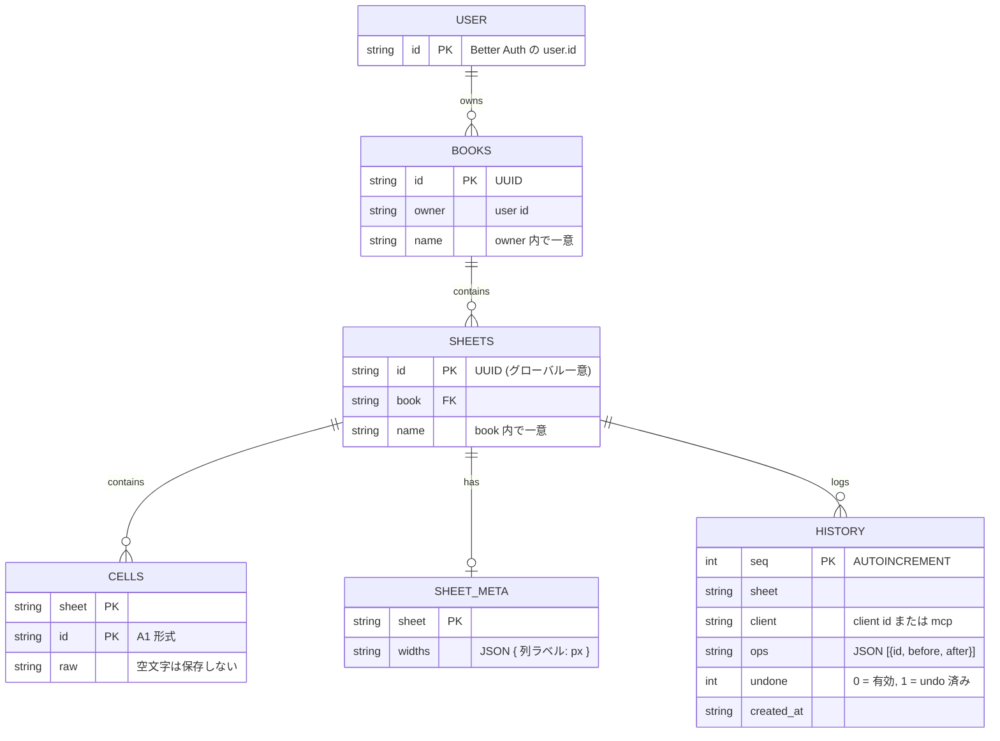
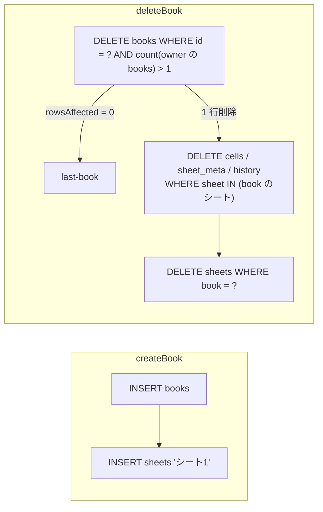
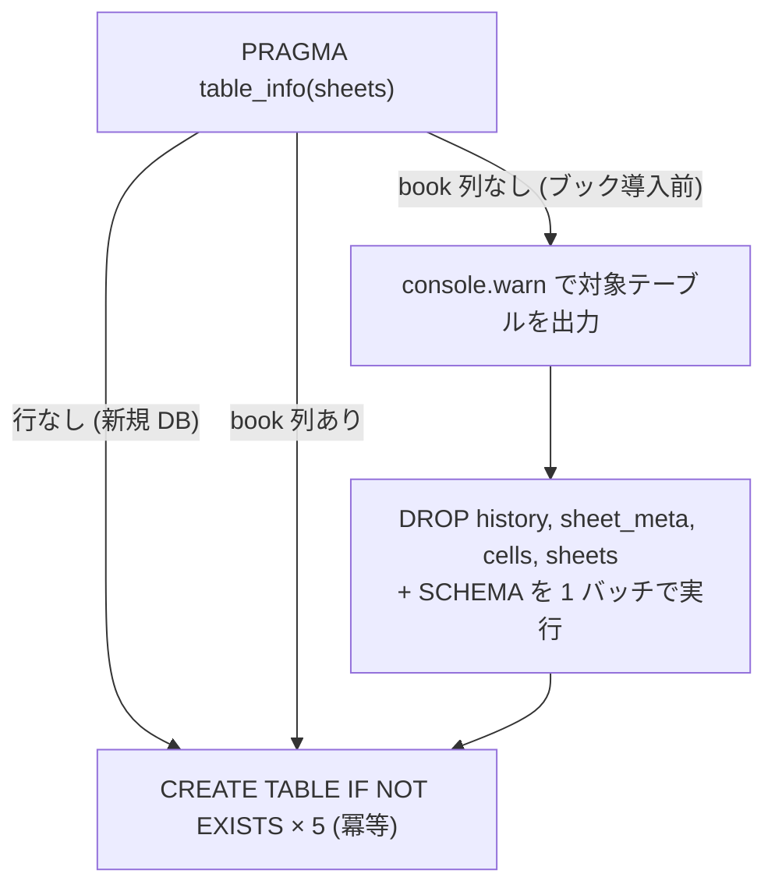

# データモデル

スプレッドシートの正本は `server/db.ts` が管理する SQLite (libsql) である。この文書はスキーマ、所有権、作成 / 削除の連鎖、スキーマ移行を扱う。同期の仕組みは [sync.md](sync.md) を参照。

## スキーマ

`USER` は Better Auth が作るテーブルで、`books.owner` から参照するだけである。外部キー制約は張っていない。一意性は `books(owner, name)` と `sheets(book, name)` の UNIQUE INDEX で守る。

## id と所有権

ブックの所属を記録するのは `sheets` だけである。シート id は UUID でグローバルに一意なので、`cells`、`sheet_meta`、`history` はシート id だけをキーにする。

権限判定はシートからブック、ブックから owner へ辿る。

| 関数 (`server/db.ts`) | 返すもの                         | 使う場面                                   |
| --------------------- | -------------------------------- | ------------------------------------------ |
| `bookOwner(id)`       | owner、無ければ null             | `/api/books/:id`、`/api/sheets?book=`、SSE |
| `sheetAccess(sheet)`  | `{ book, owner }`、無ければ null | セル、列幅、履歴の全ルート、書き込み前     |

`server/plugin.ts` の `requireBook` / `requireSheet` は、owner がリクエストユーザーと一致しなければ 404 を返す。存在しない id と他人の id を区別しないため、id の存在が漏れない。

owner に入るのは Better Auth の user id である。ブラウザはセッションから、MCP はアクセストークンの `sub` claim から得る。両者が同じ id になるのは OAuth provider に `pairwiseSecret` を設定していないためで、設定すると MCP からの所有判定が壊れる（`server/db.ts` 冒頭のコメント）。

## 名前の規則

ブックとシートは同じ規則で名前を扱う。

- 前後の空白を除く。空になれば `invalid-name`
- 同じスコープ（ブックは owner 内、シートはブック内）に同名があれば `duplicate-name`
- 名前を省略すると「ブック{N}」「シート{N}」の空き番号を採る。N は現在の件数 + 1 から探し、使用中なら増やす

エラーは HTTP ステータスに写す。

| エラー                           | HTTP | 意味                         |
| -------------------------------- | ---- | ---------------------------- |
| `invalid-name`                   | 400  | 空、または空白のみ           |
| `duplicate-name`                 | 409  | 同スコープに同名がある       |
| `unknown-book` / `unknown-sheet` | 404  | 存在しない、または他人のもの |
| `last-book` / `last-sheet`       | 400  | 最後の 1 つは削除できない    |

## 作成と削除の連鎖

ブックはシートを 1 枚持った状態でしか存在しない。シートの無いブックは UI 上の状態を作れないためである。

「最後の 1 つを残す」ガードは、件数チェックと DELETE を 1 文の条件付き DELETE にまとめている。2 タブが同時に削除しても、件数の読み取りと削除の間に割り込めない。`deleteSheet` も同じ形で、`sheets` の行を消してからセル、列幅、履歴を消す。

## セル書き込みの正規化

`applyCellMutations(cells, sheet, recordFor?)` がセル書き込みの唯一の入口である。

1. `sheetAccess` で存在確認（無ければ throw）
2. 同じ id が 1 バッチに複数あれば最後の値を採る
3. 現在の DB 値と比べ、変更の種類を決める。空文字は削除、未存在なら insert、値が違えば update、同値なら捨てる
4. 1 バッチで `client.batch(..., "write")`
5. `recordFor` があれば `history` に 1 エントリを記録
6. `dbEvents.emit("cells", book, sheet, changes)`

変更種別を DB の現状から決めるので、購読側が同じキーの delete と insert を同時に受け取ることはない。react-db の live query は同キーの delete + insert で行の一致が崩れるため、この正規化が必要である。

## 履歴テーブルの意味

`history` はシートごとに 1 本のログで、エントリはクライアント別に持つ。`ops` は `[{ id, before, after }]` で、`""` は「セルなし」を表す。undo は `before` を、redo は `after` を書き戻す。

`undone` フラグでスタックを表現する。新しいエントリを記録するとそのクライアントの `undone = 1` を全て消すため、undone なエントリは常に末尾に連続する。undo は「最新の undone = 0」、redo は「最古の undone = 1」を取る。保持数はシートあたり 200 件で、クライアントをまたいで古いものから消す。適用ルールは [sync.md](sync.md#undo--redo) を参照。

## Better Auth のテーブル

Better Auth は `server/db.ts` の libsql client を `LibsqlDialect` 経由で共有する。user、session、account、verification、jwks、OAuth クライアントなどのテーブルが同じ DB ファイルに入る。作成は `pnpm auth:migrate`（Better Auth の CLI）で行い、`SCHEMA` には含めない。

## 起動時のスキーマ処理

`server/db.ts` はモジュール読み込み時に `ready` promise を作り、全 CRUD 関数が先頭で await する。

ブック導入前の DB は `sheets.name` にグローバル UNIQUE が付いており、SQLite は制約を drop できない。データ移行はしないと決めたため、スプレッドシートの 4 テーブルを作り直す。drop と create を 1 トランザクションにまとめ、途中で落ちても半端な状態を残さない。Better Auth のテーブルは `OWNED_TABLES` に含めず、ログイン状態は消えない。

## 外部 DB への切替

`LIBSQL_URL` と `LIBSQL_AUTH_TOKEN` を設定すると Turso などへ向く。auth テーブルも同じ client を使うので一緒に移る。

ただし変更通知はプロセス内の `dbEvents` に依存する。外部から直接 DB に書いた変更はどのタブにも届かない。複数プロセスや外部ライターと共有するには、ポーリングなどの変更検知を別途実装する必要がある。
