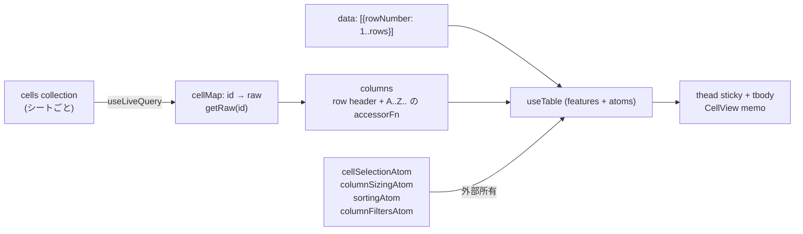
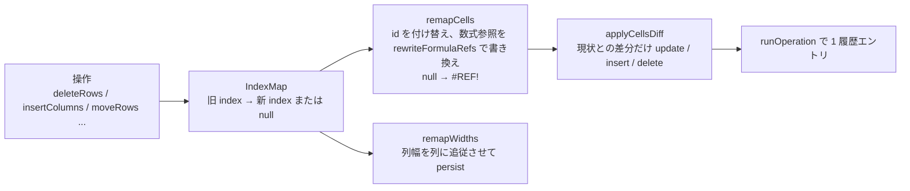

# スプレッドシートの仕組みと仕様

グリッドは `src/components/Spreadsheet.tsx` が TanStack Table v9 で描き、セル値は react-db collection から live query で読む。この文書は、セルの表現、グリッドの構成、数式、編集と選択、コピー & ペースト、ソート / フィルタ、構造操作、列幅を扱う。

## セルの表現

セル id は Excel 形式で、`src/lib/columns.ts` が唯一の変換元である。

| 関数                 | 例                                                                                          |
| -------------------- | ------------------------------------------------------------------------------------------- |
| `columnLabel(i)`     | 0 → `A`、25 → `Z`、26 → `AA`                                                                |
| `labelToColumnIndex` | `AA` → 26、不正なら -1                                                                      |
| `cellId(col, row)`   | `(26, 12)` → `AA12`（row は 1 始まり）                                                      |
| `parseCellId`        | `AA12` → `{ colIndex: 26, rowNumber: 12 }`、`/^([A-Z]+)([1-9][0-9]*)$/` に合わなければ null |

セルは `{ id, raw }` だけを持つ。`raw` は入力そのままの文字列で、`=` で始まれば数式である。空文字は「セルなし」を意味し、collection にも DB にも行が無い。

## グリッドの構成



- **行** はデータではなく `rowNumber` だけの配列で、行数分を生成する。row id は `String(rowNumber)`
- **列** は先頭に行ヘッダ列 `__rowHeader`、続いて列ラベルを id とするデータ列を列数分置く。列の `accessorFn` は評価済み表示値を返し、数値に見える文字列は数値にする
- **features** は `cellSelectionFeature`、`columnSizingFeature`、`columnResizingFeature`、`rowSortingFeature`、`columnFilteringFeature`。選択、列幅、ソート、フィルタの state は `atoms` オプションで外部の atom に所有させ、React 外のコード（編集確定、構造操作）から table インスタンス無しで読み書きできる
- **live query** は `q.from({cell}).select(({cell}) => ({...cell}))` の spread select を使う。react-db 0.x では素の `from` が同キーの更新で不一致な行を出すためである
- `cellMap` を `data` の依存に入れて、セル編集のたびにソート / フィルタ済み row model を再計算させる。`accessorFn` が `getRaw` を読むことを table は追跡できない
- `SheetGrid` はシート id を key に再マウントし、列幅、ビュー状態、live query のマウント単位の effect を新しいシートで張り直す

### グリッドの大きさ

行数と列数は `sheetStore` の `rows` / `cols` で、既定は 26 列 × 50 行。ツールバーの「+ 行」「+ 列」で増える。保存しないが、読み込んだセルが収まるよう `ensureFits` で広げる。シート切替時は `gridSizeBySheet` に退避し、戻ると復元する。リロードで初期値に戻り、セルから再び広がる。

## 数式

`src/lib/formula.ts` は関数を持たない最小の評価器である。文法は次のとおり。

```
expr   := term (("+" | "-") term)*
term   := factor (("*" | "/") factor)*
factor := ("-" | "+") factor | "(" expr ")" | number | ref | "#REF!"
number := \d*\.?\d+
ref    := [A-Za-z]+\d+   (大文字に正規化)
```

`displayValue(selfId, raw, getRaw)` が表示値を決める。

| 条件                                                  | 結果                        |
| ----------------------------------------------------- | --------------------------- |
| `raw` が undefined                                    | `""`                        |
| `=` で始まらない                                      | `raw` そのまま              |
| 参照先が空                                            | 0 として計算                |
| 参照先が数式                                          | 再帰的に評価                |
| 参照先が数値でない文字列                              | NaN → `#ERROR`              |
| 0 除算など非有限                                      | `#ERROR`                    |
| 循環参照（自己参照を含む）                            | `#ERROR`                    |
| 構文エラー                                            | `#ERROR`                    |
| `#REF!` トークンを含む、または `#REF!` になる式を参照 | `#REF!`（Excel 同様に連鎖） |
| 正常                                                  | 小数第 10 位で丸めた数値    |

循環は評価パス（`Set<string>`）で検出する。`selfId` を最初から入れておくので `A1 = "=A1"` も検出できる。`#REF!` は `RefError` として伝播し、他のエラーと区別して表示する。

`rewriteFormulaRefs(raw, mapRef)` は構造操作用で、参照トークンだけを置き換え、演算子や空白は書いたまま残す。`mapRef` が null を返した参照は `#REF!` になる。数値を参照より先にマッチさせ、数字が参照の一部として読まれないようにしている。

## 編集

編集状態は `sheetStore.editing = { cellId, seed }` が持つ。`seed` は編集開始時の初期値で、文字キーで始めた場合はその文字、Enter / F2 / ダブルクリックなら null（既存の raw を編集）。

`CellEditor` は textarea で、行数に応じて下に伸びる。

| キー                    | 動作              |
| ----------------------- | ----------------- |
| Enter                   | 確定して 1 つ下へ |
| Tab                     | 確定して 1 つ右へ |
| Alt+Enter / Shift+Enter | 改行を挿入        |
| Escape                  | 破棄              |
| blur                    | 確定（移動なし）  |

IME 変換確定の Enter / Tab / Escape は `isComposing` と `keyCode === 229` で除外する。確定は `setCellWithHistory` を通り、値が変わらなければ履歴に残さない。複数行の値は 1 行目だけ表示し、続きがあることを `⏎` で示す。

数式バー（`FormulaBar`）はアクティブセルの raw を表示し、Enter で確定、Escape で戻す。選択セルか raw が変わると key で作り直す。

## 選択とキーボード

選択は `cellSelectionAtom`（`CellSelectionState`、範囲の配列）が持つ。アクティブセルは最後の範囲の anchor である。

| 操作                         | 動作                                               |
| ---------------------------- | -------------------------------------------------- |
| 矢印 / Shift+矢印            | 移動 / 範囲拡張（table の `moveCellSelection` 系） |
| Tab / Shift+Tab              | 右 / 左へ                                          |
| Enter / F2                   | 編集開始                                           |
| 文字キー                     | その文字を seed に編集開始                         |
| Delete / Backspace           | 選択範囲のセルを削除（1 操作として履歴に残る）     |
| ⌘A                           | 全選択                                             |
| ⌘Z / ⌘⇧Z / ⌘Y                | undo / redo                                        |
| 列ヘッダ / 行ヘッダ クリック | 列 / 行全体を選択。Shift で拡張                    |
| ドラッグ                     | マウスダウンで開始、mouseenter で拡張              |

編集確定後の上下移動は `rowNavigator` を通し、ソート / フィルタ後の表示順で動く。絶対行番号で動くと非表示行に入り、次のキー入力が見えないセルを編集してしまう。

`AutoScrollFollower` は選択の動く角が sticky ヘッダの下に隠れないようスクロールする。ヘッダクリックによる行 / 列全体の選択では追従しない。

## コピー & ペースト

`src/lib/tsv.ts` が Excel / Google Sheets 互換の TSV を扱う。

- **コピー**: 最初の矩形範囲を raw 値で TSV にする。タブ、改行、二重引用符を含むセルは `"..."` で括り、内部の `"` は `""` にする
- **ペースト**: TSV を解析し、アクティブセルを原点に配置する。Excel の末尾改行が生む空行は除く。`ensureFits` でグリッドを広げ、貼り付け範囲を選択する。全体が 1 つの履歴エントリになる

## ソートとフィルタ

ソートとフィルタは表示だけを変え、セルのデータに触れない。

- state は `sortingAtom` / `columnFiltersAtom`。シートごとに localStorage へ保存し、他タブには影響しない
- ソートは 1 列のみ。ヘッダメニューで 昇順 → 降順 → 解除 を巡回する。数値は数値として比較し、文字列は `localeCompare("ja")`。空セルは末尾
- フィルタは列ごとの部分一致（大文字小文字を区別しない）で、複数列は AND
- ビューが有効な間は構造操作（挿入、削除、ドラッグ移動）を無効にする。列 id ベースのフィルタ state が削除でずれ、並び替えた表示では挿入位置が曖昧になるためである
- ヘッダの「解除」で両方を消す

## 構造操作

`src/lib/structure.ts` は行 / 列の削除、挿入、移動を扱う。



| 操作 | IndexMap       | 備考                                                      |
| ---- | -------------- | --------------------------------------------------------- |
| 削除 | `deletionMap`  | 全行 / 全列の削除は拒否                                   |
| 挿入 | `insertionMap` | 挿入位置以降をずらす。挿入した範囲を選択する              |
| 移動 | `blockMoveMap` | ブロック内へのドロップは no-op。ドラッグ & ドロップで呼ぶ |

- 削除した位置を参照する数式は `#REF!` になる。移動や挿入では参照が追従する
- `applyCellsDiff` は現在の collection と目標状態を比べ、値が変わったセルは update で書く。同キーの delete + insert を 1 バッチに入れないためである
- 1 操作は `runOperation` で 1 履歴エントリになる。ただしグリッドの行数 / 列数はローカル状態なので、undo してもセルだけが戻る
- 移動はヘッダのドラッグ & ドロップで行い、ドロップ位置は要素の中央を境に前後を決める。列リサイズ中のドラッグ開始は無視する

ツールバーの `StructureToolbar` は行 / 列全体が選択されている間だけ挿入と削除のボタンを出す。削除に確認ダイアログは無く、undo を安全網とする（組み込みブラウザで native dialog が抑止され、削除できなくなった経緯がある）。

## 列幅

列幅は `columnSizingAtom` が列ラベルをキーに持つ。ヘッダ右端のハンドルが table の `getResizeHandler` を呼び、`columnResizeMode: "onChange"` で mousemove ごとに atom が変わる。300 ms debounce でサーバに保存し、他タブへは SSE で届く。既定 88 px、最小 48 px、最大 480 px。永続化の配線は [sync.md](sync.md#列幅) を参照。

## テーマ

`ThemeToggle` は light / dark / auto を localStorage の `theme` に保存し、`<html>` に class と `data-theme` を付ける。`__root.tsx` のインラインスクリプトが描画前に同じ処理を行い、初回描画のちらつきを防ぐ。色は `src/styles.css` の CSS 変数で定義する。
