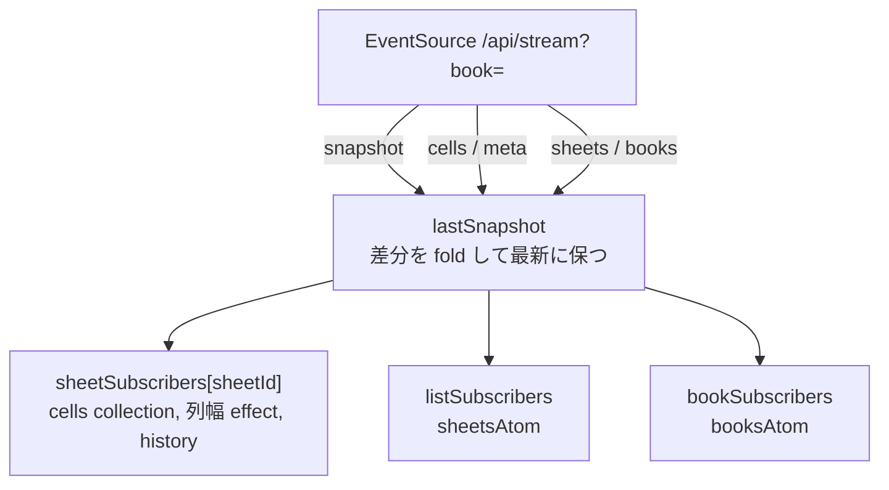
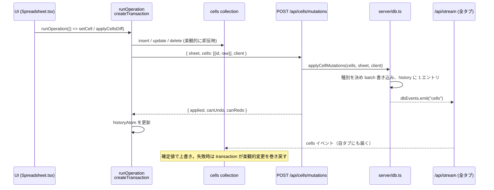
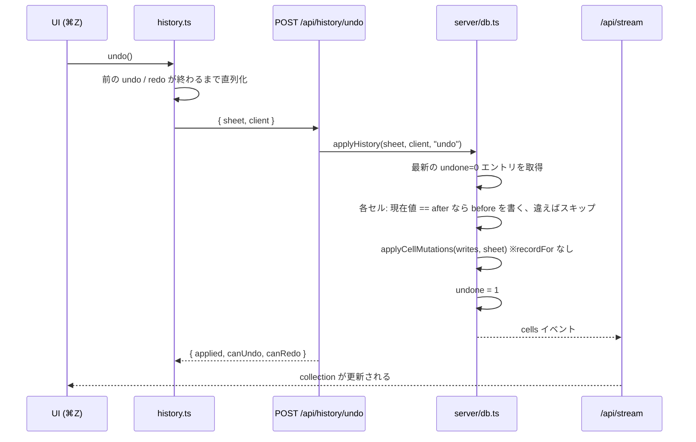
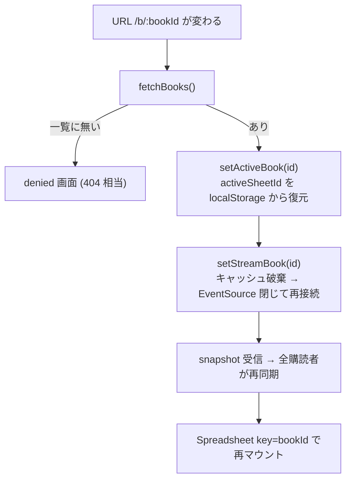

# ローカルとリモートの同期

サーバの SQLite が正本で、ブラウザ側はそのミラーである。書き込みは HTTP で送り、確定した変更は SSE (`/api/stream`) で全タブに戻る。この文書は、サーバ側の変更通知、SSE、クライアント側のミラー、楽観的書き込み、undo / redo、ブック切替を扱う。

## 層の対応

| 層           | 場所                                | 役割                                                           |
| ------------ | ----------------------------------- | -------------------------------------------------------------- |
| 正本         | `server/db.ts`                      | SQLite の CRUD。書き込み後に `dbEvents.emit`                   |
| 配信         | `server/plugin.ts` `handleStream`   | 1 ブック分の snapshot を送り、以後 `dbEvents` を中継           |
| 受信         | `src/db-collections/server-sync.ts` | タブに 1 本の EventSource。snapshot をキャッシュし購読者へ配る |
| セルのミラー | `src/db-collections/cells.ts`       | シートごとの react-db collection                               |
| 一覧のミラー | `sheets.ts` / `books.ts`            | `sheetsAtom` / `booksAtom`                                     |
| 列幅のミラー | `Spreadsheet.tsx` + `sheet-meta.ts` | `columnSizingAtom`、debounce して POST                         |
| 履歴         | `src/lib/history.ts`                | 操作を 1 トランザクションで POST、undo / redo を要求           |

## サーバ側の変更通知

`server/db.ts` の `dbEvents` は Node の EventEmitter で、書き込みが確定するたびに次を emit する。

| イベント | 引数                       | 発生源                               |
| -------- | -------------------------- | ------------------------------------ |
| `cells`  | `(book, sheet, changes[])` | `applyCellMutations`（no-op は除く） |
| `meta`   | `(book, sheet, widths)`    | `setWidths`（同値は emit しない）    |
| `sheets` | `(book, sheets[])`         | シートの作成 / リネーム / 削除       |
| `books`  | `(owner, books[])`         | ブックの作成 / リネーム / 削除       |

`cells` の `changes` は `{type: "insert" | "update" | "delete", id, raw?}` で、種別は DB の現状から決めている（[data-model.md](data-model.md#セル書き込みの正規化)）。

## SSE ストリーム

`GET /api/stream?book=<id>` はセッション必須で、ブックの所有者でなければ 404 を返す。接続直後に **snapshot** を 1 回送り、その後は差分イベントを流す。

| イベント   | データ                                                             | 送る条件                |
| ---------- | ------------------------------------------------------------------ | ----------------------- |
| `snapshot` | `{ book, books, sheets, bySheet: { sheetId: { cells, widths } } }` | 接続時（再接続を含む）  |
| `cells`    | `{ sheet, changes }`                                               | イベントの book が一致  |
| `meta`     | `{ sheet, widths }`                                                | 同上                    |
| `sheets`   | `{ sheets }`                                                       | 同上                    |
| `books`    | `{ books }`                                                        | イベントの owner が一致 |

snapshot はブック全体（全シートのセルと列幅）を含む。EventSource は切断時に自動再接続し、サーバは再び snapshot を送るので、これが再同期の手段になる。30 秒ごとにコメント行を送って接続を保つ。接続が閉じたらリスナーを外す。

`books` イベントだけは book ではなく owner で照合する。ブック一覧はブックに属さない情報だからで、book で照合すると届かない。

## クライアント側の受信

`server-sync.ts` はタブに 1 本だけ EventSource を持ち、ブック単位で接続する。ブラウザはホストあたりの SSE 接続数を制限するため、シートごとに接続を張らない。

snapshot をキャッシュし、以後の差分を畳み込む。これにより、接続後に初めて開いたシートや、gc 後に再購読した collection も接続時点ではなく現在の状態を受け取る。`subscribeSheetSync` はキャッシュがあれば購読時に即座に `onSnapshot` を呼ぶ。

snapshot に無いシート id（削除済み、別ブック、古い localStorage）は空データとして扱い、エラーにしない。

## セルの collection

`getCellsCollection(sheetId)` はシートごとに `createCollection` し、registry に保持する。同期は `subscribeSheetSync` に繋ぐ。

- `onSnapshot`: `begin` → `truncate` → 全セルを insert → `commit` → `markReady`
- `onCellChanges`: `begin` → 種別どおりに write → `commit`

snapshot を truncate + rewrite として扱うため、再接続で状態がずれても snapshot 1 回で揃う。SSR では `markReady` だけ呼び、空の collection として動く。

購読者がいなくなった collection は react-db の gcTime 後に片付き、次に購読されるとキャッシュ済み snapshot から同期をやり直す。

## 書き込み経路

UI からのセル書き込みはすべて `runOperation` を通る。

1 回の `runOperation` の中で起きた collection 操作は 1 トランザクションにまとまり、1 リクエストで送る。collection 自身の `onInsert` / `onUpdate` / `onDelete` も POST するが、`client` を付けないため履歴に残らない。現状の UI コードはすべて `runOperation` 経由で、collection の handler はトランザクション外で呼ばれたときの保険である。

MCP の `set_cells` はサーバ内で直接 `applyCellMutations(cells, sheet, "mcp")` を呼ぶ。SSE には同じ `cells` イベントが流れるので、タブ側の扱いはブラウザからの書き込みと変わらない。

## undo / redo

履歴はサーバに置き、`(sheet, client)` ごとに持つ。client id は `src/lib/client-id.ts` が localStorage に保存する UUID で、同じブラウザの全タブが共有する。MCP は固定 id `"mcp"` を使う。

- **衝突の扱い**: あるセルが自分の操作後に他者に書き換えられていれば、そのセルは戻さない。エントリのフラグは戻さないセルがあっても反転する
- **undo は履歴に残らない**: undo / redo の適用は `recordFor` を渡さないため、新しいエントリにならない
- **redo の消滅**: 新しい操作を記録すると、そのクライアントの undone エントリを消す
- **ボタン状態**: `historyAtom` は `canUndo` / `canRedo` を持ち、操作の応答、シート切替、アクティブシートの `cells` イベント受信のたびに `/api/history/state` から取り直す。別タブ（同じ client id）の操作を反映するためである
- **連打の直列化**: ⌘Z を連打しても、タブ内で 1 件ずつ順に送る

## 列幅

列幅は `columnSizingAtom` が持ち、`SheetGrid` のマウント時に次の順で配線する。

1. atom を `{}` にリセット
2. `subscribeSheetSync` で snapshot と `meta` イベントを atom に反映（キャッシュ済み snapshot が初期ロードを兼ねる）
3. atom の変更を 300 ms debounce して `POST /api/meta`

2 を 3 より先に張るので、読み込み時の反映が自分の書き込みとして跳ね返らない。サーバは同値の書き込みを捨てて `meta` を emit しないため、「persist → SSE → atom set → persist」のエコーはサーバで止まる。debounce のタイマーはシートごとに持ち、シートを切り替えても元のシートに書く。

## シート一覧とブック一覧

一覧は atom で持ち、SSE の `sheets` / `books` イベントで全量を差し替える。`fetchBooks` だけは SSE を介さない直接 fetch で、ルートがストリームを向ける先のブック id を得るために使う。

`initSheetsSync` は一覧を受け取るたびに、アクティブシートが一覧に無ければ先頭シートへ切り替える。まだ何も憶えていないブック、古い localStorage、他タブや MCP による削除を同じ経路で吸収する。

## ブック切替

ブックは URL (`/b/$bookId`) が決め、`BookRoute` の effect が切替を駆動する。

購読者は snapshot を全再同期として扱うので、切替時に個別の調整はいらない。再接続前にキャッシュを捨て、前のブックのデータを読む隙間を無くしている。`Spreadsheet` はブックごとに、`SheetGrid` はシートごとに key で再マウントし、マウント単位の effect が古い id に紐付いたまま残らないようにする。

## 制約

- 変更検知はプロセス内のみである。Turso など外部から直接書いた変更はタブに届かない
- SSE の snapshot はブック全体で、大きなブックほど再接続コストが増える
- 楽観的更新は「自タブで即反映、サーバ応答で確定」であり、他タブとの競合解決は last-write-wins である
